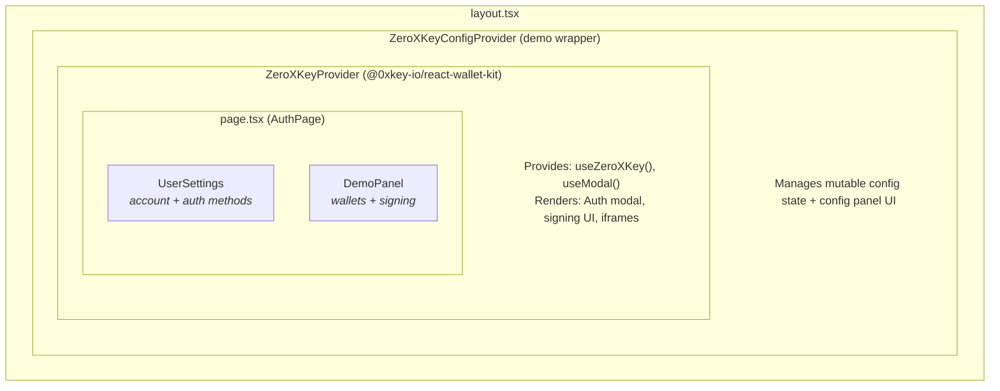
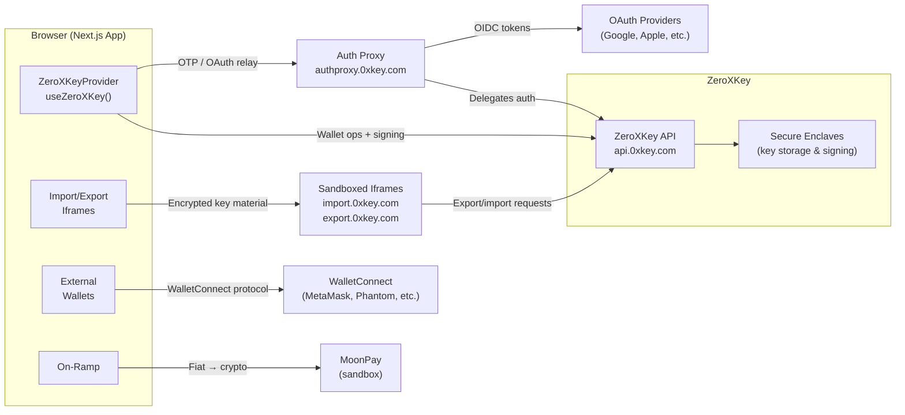
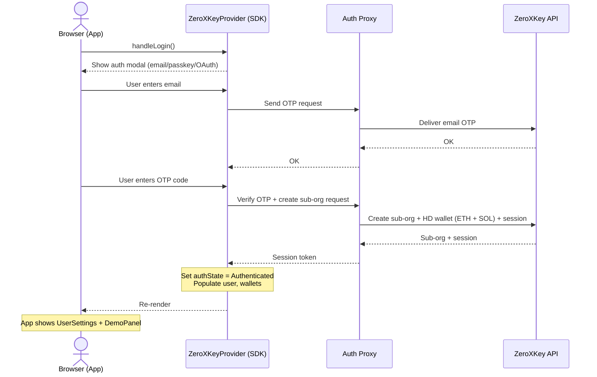
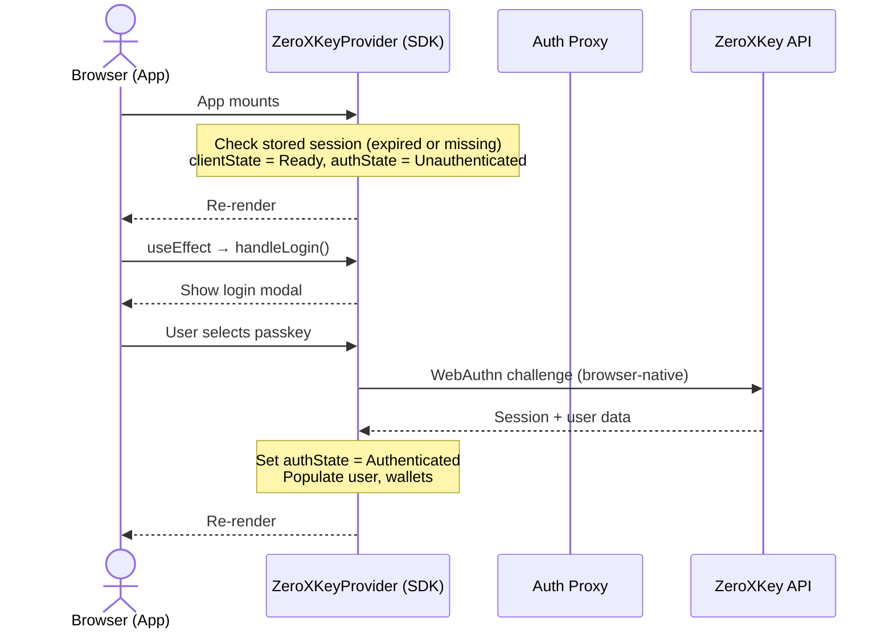
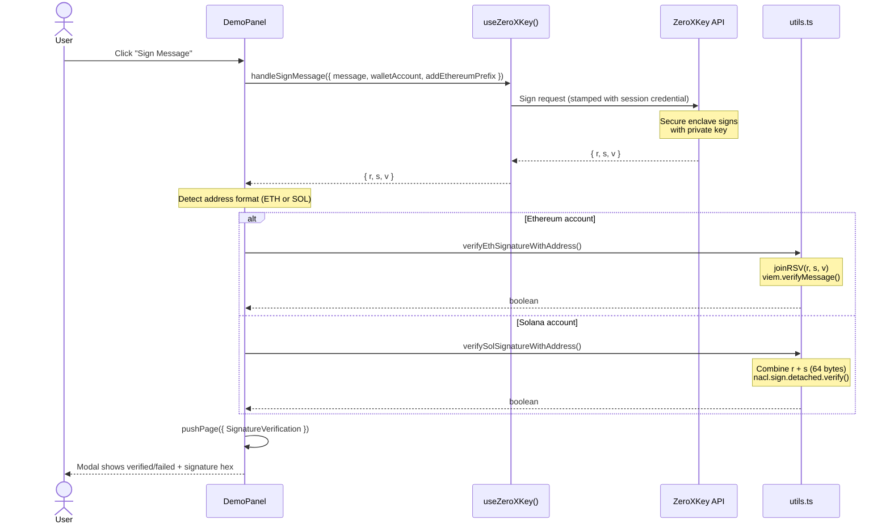
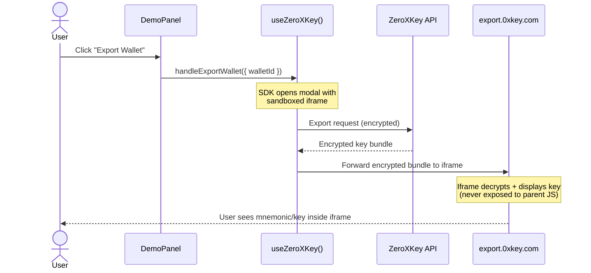

# React Wallet Kit Example

A comprehensive reference application demonstrating [`@0xkey-io/react-wallet-kit`](https://www.npmjs.com/package/@0xkey-io/react-wallet-kit) (the Embedded Wallet Kit / EWK). This example showcases authentication, embedded wallet management, message signing, wallet import/export, external wallet connections, and fiat on-ramp — all without requiring a custom backend.

## Table of Contents

- [Getting Started](#getting-started)
  - [Prerequisites](#prerequisites)
  - [Environment Setup](#environment-setup)
  - [Run](#run)
- [How the ZeroXKey Integration Works](#how-the-0xkey-integration-works)
  - [Architecture Overview](#architecture-overview)
  - [System Context Diagram](#system-context-diagram)
  - [Component Hierarchy](#component-hierarchy)
  - [Provider Setup](#provider-setup)
  - [Configuration (`src/constants.ts`)](#configuration-srcconstantsts)
  - [Authentication Flow](#authentication-flow)
  - [First-Time Signup Sequence](#first-time-signup-sequence)
  - [Returning User Login Sequence](#returning-user-login-sequence)
  - [The `useZeroXKey()` Hook](#the-usezeroxkey-hook)
  - [Message Signing & Verification](#message-signing--verification)
  - [Message Signing Sequence](#message-signing-sequence)
  - [Wallet Model](#wallet-model)
  - [Wallet Export Sequence](#wallet-export-sequence)
  - [The `useModal()` Hook](#the-usemodal-hook)
  - [Auth Method Management](#auth-method-management)
  - [Error Handling](#error-handling)
- [Project Structure](#project-structure)
- [Key Dependencies](#key-dependencies)
- [Learn More](#learn-more)

## Getting Started

### Prerequisites

- Node.js 18+
- A [ZeroXKey](https://app.0xkey.com) organization
- An Auth Proxy configuration (created in the ZeroXKey Dashboard under **Auth**)

### Environment Setup

Copy the example env file and fill in your values:

```bash
cp .env.local.example .env.local
```

| Variable                                | Required | Description                                                                                             |
| --------------------------------------- | -------- | ------------------------------------------------------------------------------------------------------- |
| `NEXT_PUBLIC_ORGANIZATION_ID`           | Yes      | Your ZeroXKey organization ID (from Dashboard)                                                          |
| `NEXT_PUBLIC_AUTH_PROXY_ID`             | Yes      | Auth Proxy config ID (from Dashboard > Auth)                                                            |
| `NEXT_PUBLIC_BASE_URL`                  | No       | ZeroXKey API base URL (defaults to `https://api.0xkey.com`)                                             |
| `NEXT_PUBLIC_AUTH_PROXY_URL`            | No       | Auth Proxy URL (defaults to `https://authproxy.0xkey.com`)                                              |
| `NEXT_PUBLIC_WALLETCONNECT_PROJECT_ID`  | No       | [WalletConnect](https://cloud.walletconnect.com/) project ID (required for external wallet connections) |
| `NEXT_PUBLIC_WALLETCONNECT_PROJECT_URL` | No       | Your application URL for WalletConnect metadata                                                         |
| `NEXT_PUBLIC_GOOGLE_CLIENT_ID`          | No       | Google OAuth client ID (for Google social login)                                                        |
| `NEXT_PUBLIC_FACEBOOK_CLIENT_ID`        | No       | Facebook OAuth client ID                                                                                |
| `NEXT_PUBLIC_APPLE_CLIENT_ID`           | No       | Apple OAuth client ID                                                                                   |
| `NEXT_PUBLIC_OAUTH_REDIRECT_URI`        | No       | OAuth callback URL                                                                                      |

### Run

```bash
pnpm install
pnpm dev
```

The app launches at `http://localhost:3000`.

---

## How the ZeroXKey Integration Works

### Architecture Overview



The integration is layered into three tiers:

1. **`ZeroXKeyProvider`** (from the SDK) — the core. Manages authentication state, wallet data, signing operations, and renders the auth/signing modal. Exposes everything through the `useZeroXKey()` and `useModal()` hooks.
2. **`ZeroXKeyConfigProvider`** (custom, in `src/providers/config/`) — a demo-specific wrapper that makes the `ZeroXKeyProviderConfig` mutable at runtime, enabling the interactive configuration panel. In a production app you would pass a static config directly to `ZeroXKeyProvider`.
3. **Page components** (`UserSettings`, `DemoPanel`) — consume the hooks to build the UI.

### System Context Diagram

Shows how the browser app communicates with external services. All private key operations happen server-side in ZeroXKey's secure enclaves — the browser never touches key material directly (except through sandboxed import/export iframes).



### Component Hierarchy

Detailed view of the React component tree and the data each component consumes from the SDK hooks.

```
layout.tsx
│
└─► ZeroXKeyConfigProvider ─── useZeroXKeyConfig() ──► { config, setConfig, demoConfig }
    │
    ├─► ZeroXKeyProvider (config, callbacks)
    │   │
    │   │   Provides: useZeroXKey(), useModal()
    │   │   Renders:  Modal overlay (auth screens, signing prompts, iframes)
    │   │
    │   └─► page.tsx (AuthPage)
    │       │
    │       │   Uses: useZeroXKey() → { handleLogin, clientState, authState }
    │       │
    │       ├── [Unauthenticated] ─► Persistent (non-closable) login modal / Error
    │       │
    │       └── [Authenticated]
    │           │
    │           ├─► UserSettings
    │           │   │   Uses: useZeroXKey() → { user, handleAddEmail, handleAddPhoneNumber,
    │           │   │                          handleUpdateUserName, config, logout }
    │           │   │         useModal()   → { pushPage }
    │           │   │
    │           │   ├── AccountParam (userName, email, phone)
    │           │   │
    │           │   ├── EmailAuthButton
    │           │   │     Uses: useZeroXKey() → { user, handleAddEmail, handleRemoveUserEmail }
    │           │   │
    │           │   ├── PhoneAuthButton
    │           │   │     Uses: useZeroXKey() → { user, handleAddPhoneNumber, handleRemoveUserPhoneNumber }
    │           │   │
    │           │   ├── SocialButton (x5: Google, Apple, Facebook, X, Discord)
    │           │   │     Uses: useZeroXKey() → { user, handleAddOauthProvider, handleRemoveOauthProvider }
    │           │   │
    │           │   ├── AuthenticatorButton
    │           │   │     Uses: useZeroXKey() → { user, handleAddPasskey, handleRemovePasskey }
    │           │   │
    │           │   └── [Modal] DeleteSubOrgWarning
    │           │         Uses: useZeroXKey() → { session, user, wallets, deleteSubOrganization, logout }
    │           │               useModal()  → { isMobile, closeModal }
    │           │
    │           └─► DemoPanel
    │               │   Uses: useZeroXKey() → { wallets, createWallet, createWalletAccounts,
    │               │                          fetchWallets, handleSignMessage, handleExportWallet,
    │               │                          handleImportWallet, handleConnectExternalWallet,
    │               │                          fetchWalletProviders, handleOnRamp }
    │               │         useModal()   → { pushPage }
    │               │
    │               ├── Wallet selector (Menu dropdown + "Add Wallet")
    │               ├── "Connect Wallet" button (external wallets via WalletConnect)
    │               ├── Account selector (RadioGroup — ETH/SOL addresses)
    │               ├── "Sign Message" → [Modal] SignatureVerification
    │               ├── "Add Funds" (MoonPay on-ramp)
    │               └── "Export Wallet" / "Import Wallet" (embedded wallets only)
    │
    └─► ZeroXKeyConfigPanel (interactive config editor — demo only)
```

### Provider Setup

The entry point is `src/app/layout.tsx`. It imports the SDK stylesheet, constructs the config, and wraps the app:

```tsx
import "@0xkey-io/react-wallet-kit/styles.css";

<ZeroXKeyConfigProvider
  initialConfig={initialConfig}
  callbacks={{
    onError: (error) => {
      // Handle ZeroXKeyError by code
      switch (error.code) {
        case ZeroXKeyErrorCodes.ACCOUNT_ALREADY_EXISTS:
          notify(
            "This social login is already associated with another account.",
          );
          break;
        default:
          notify(error.message);
      }
    },
  }}
>
  {children}
</ZeroXKeyConfigProvider>;
```

Inside `ZeroXKeyConfigProvider`, the SDK's `ZeroXKeyProvider` is rendered with the current config:

```tsx
<ZeroXKeyProvider config={config} callbacks={callbacks}>
  {children}
</ZeroXKeyProvider>
```

### Configuration (`src/constants.ts`)

The `ZeroXKeyProviderConfig` object controls everything the SDK does. Here's how each section maps to behavior:

#### API Endpoints

```ts
apiBaseUrl: "https://api.0xkey.com",       // ZeroXKey API (wallet ops, signing)
authProxyUrl: "https://authproxy.0xkey.com", // Auth Proxy (OTP, OAuth — no backend needed)
authProxyConfigId: "...",                      // Ties to your Dashboard auth config
organizationId: "...",                         // Your parent organization
importIframeUrl: "https://import.0xkey.com", // Secure iframe for wallet import
exportIframeUrl: "https://export.0xkey.com", // Secure iframe for wallet export
```

The **Auth Proxy** is ZeroXKey's managed service that handles OTP delivery (email/SMS) and OAuth token exchange without requiring you to build a backend. It's configured in the ZeroXKey Dashboard (allowed origins, session lifetimes, email templates, etc.) and referenced here by its config ID.

The **import/export iframes** are ZeroXKey-hosted secure contexts used for wallet import and export operations. Private key material never leaves these sandboxed iframes.

#### Authentication Methods

```ts
auth: {
  methods: {
    emailOtpAuthEnabled: true,     // Email one-time password
    smsOtpAuthEnabled: false,      // SMS one-time password (coming soon — hidden in the demo)
    passkeyAuthEnabled: true,      // WebAuthn (Touch ID, Face ID, Windows Hello)
    walletAuthEnabled: true,       // Sign-in with external wallet (SIWE/SIWS)
    googleOauthEnabled: true,      // Google OAuth
    appleOauthEnabled: false,      // Apple OAuth (coming soon — hidden in the demo)
    facebookOauthEnabled: false,   // Facebook OAuth
    xOauthEnabled: false,          // X/Twitter OAuth
    discordOauthEnabled: false,    // Discord OAuth
  },
  methodOrder: ["socials", "email", "passkey", "wallet"],
  autoRefreshSession: true,  // Auto-refresh sessions before expiry
}
```

The `methodOrder` array controls the display order of auth methods in the login modal. `autoRefreshSession` keeps users logged in during active use. `SMS OTP` and `Apple` OAuth are still wired through the configuration but intentionally omitted from `methodOrder` and the demo configuration panel while the experiences are being finalized.

#### Sub-Organization & Wallet Creation on Signup

When a user authenticates for the first time, ZeroXKey creates a **sub-organization** under your parent org. The `createSuborgParams` config defines what wallets and accounts are provisioned at signup:

```ts
auth: {
  createSuborgParams: {
    emailOtpAuth: createSuborgParams,  // Config for email signups
    smsOtpAuth: createSuborgParams,    // Config for SMS signups
    passkeyAuth: createSuborgParams,   // Config for passkey signups
    walletAuth: createSuborgParams,    // Config for wallet signups
    oauth: createSuborgParams,         // Config for OAuth signups
  },
}
```

Each method references the same `CreateSubOrgParams` in this example:

```ts
const createSuborgParams: CreateSubOrgParams = {
  customWallet: {
    walletName: "Wallet 1",
    walletAccounts: [
      {
        addressFormat: "ADDRESS_FORMAT_ETHEREUM",
        curve: "CURVE_SECP256K1",
        pathFormat: "PATH_FORMAT_BIP32",
        path: "m/44'/60'/0'/0/0",
      },
      {
        addressFormat: "ADDRESS_FORMAT_SOLANA",
        curve: "CURVE_ED25519",
        pathFormat: "PATH_FORMAT_BIP32",
        path: "m/44'/501'/0'/0/0",
      },
    ],
  },
};
```

This means every new user gets an HD wallet with both an Ethereum account (secp256k1, BIP-44 path `m/44'/60'/0'/0/0`) and a Solana account (ed25519, BIP-44 path `m/44'/501'/0'/0/0`) created automatically.

#### External Wallet Connections (WalletConnect)

```ts
walletConfig: {
  features: {
    auth: true,        // Enable wallet-based authentication
    connecting: true,  // Enable connecting external wallets post-login
  },
  chains: {
    ethereum: { native: true, walletConnectNamespaces: ["eip155:1"] },
    solana: { native: true, walletConnectNamespaces: ["solana:5eykt4UsFv8P8NJdTREpY1vzqKqZKvdp"] },
  },
  walletConnect: {
    projectId: "...",
    appMetadata: { name: "ZeroXKey Wallet", description: "...", url: "...", icons: [...] },
  },
}
```

#### UI Customization

```ts
ui: {
  darkMode: true,
  borderRadius: 16,
  renderModalInProvider: true, // Render modal inside the provider tree (vs portal)
  colors: {
    light: {
      primary: "#335bf9",
      modalBackground: "#f5f7fb",
    },
    dark: {
      primary: "#335bf9",
      primaryText: "#ffffff",
      modalBackground: "#111216",
      modalText: "#f5f7fb",
      button: "#202124",
      iconBackground: "#202124",
      iconText: "#ffffff",
    },
  },
}
```

In dark mode the demo explicitly overrides surface tokens (`modalBackground`, `button`, `iconBackground`, `iconText`, `primaryText`, `modalText`) so that buttons and input fields render darker than the modal background, keeping social icons and text legible.

---

### Authentication Flow

The authentication flow begins in `src/app/page.tsx`:

```
1. App mounts → ZeroXKeyProvider initializes (clientState = Loading)
2. SDK initializes client, checks for existing session → clientState = Ready
3. useEffect fires: if Ready + Unauthenticated → calls handleLogin()
4. handleLogin() opens the SDK's modal with all enabled auth methods
5. User selects a method and completes auth
6. SDK creates sub-org (first time) or authenticates against existing one
7. authState transitions to Authenticated
8. App renders UserSettings + DemoPanel
```

The relevant code:

```tsx
const { handleLogin, clientState, authState } = useZeroXKey();

useEffect(() => {
  if (
    clientState === ClientState.Ready &&
    authState === AuthState.Unauthenticated
  ) {
    handleLogin();
  }
}, [clientState]);
```

`handleLogin()` is the SDK's all-in-one entry point. It renders a modal with the configured auth methods (passkeys, email OTP, OAuth, external wallet) and orchestrates the entire flow — including sub-organization creation, session establishment, and wallet provisioning.

### First-Time Signup Sequence

When a new user authenticates for the first time (e.g., via email OTP), the SDK creates a sub-organization and provisions wallets automatically based on `createSuborgParams`.



### Returning User Login Sequence

When a user with an existing sub-organization logs back in, no sub-org creation occurs — the SDK authenticates against the existing one and restores the session.



Note: When `autoRefreshSession: true` is set and a valid session exists in storage, the SDK restores the session automatically without showing the login modal. The user goes straight to the authenticated state.

### The `useZeroXKey()` Hook

This is the primary API surface. The example uses these methods:

#### State

| Property      | Type                     | Description                                                                     |
| ------------- | ------------------------ | ------------------------------------------------------------------------------- |
| `authState`   | `AuthState`              | `Authenticated` or `Unauthenticated`                                            |
| `clientState` | `ClientState`            | `Loading`, `Ready`, or `Error`                                                  |
| `user`        | `User`                   | Current user (email, phone, authenticators, oauthProviders, apiKeys)            |
| `wallets`     | `Wallet[]`               | All wallets (embedded + connected), auto-refreshed on changes                   |
| `session`     | `Session`                | Current session (includes `organizationId` for the sub-org)                     |
| `config`      | `ZeroXKeyProviderConfig` | The active config (used by `UserSettings` to conditionally render auth methods) |

#### Authentication

| Method                          | Used In               | Description                                   |
| ------------------------------- | --------------------- | --------------------------------------------- |
| `handleLogin()`                 | `page.tsx`            | Opens the unified login modal                 |
| `handleAddEmail()`              | `UserSettings`        | Links an email to the current user            |
| `handleRemoveUserEmail()`       | `EmailAuthButton`     | Removes the linked email                      |
| `handleAddPhoneNumber()`        | `UserSettings`        | Links a phone number                          |
| `handleRemoveUserPhoneNumber()` | `PhoneAuthButton`     | Removes the linked phone                      |
| `handleAddOauthProvider()`      | `SocialButton`        | Links an OAuth provider (Google, Apple, etc.) |
| `handleRemoveOauthProvider()`   | `SocialButton`        | Unlinks an OAuth provider                     |
| `handleAddPasskey()`            | `AuthenticatorButton` | Adds a new passkey authenticator              |
| `handleRemovePasskey()`         | `AuthenticatorButton` | Removes a passkey authenticator               |
| `handleUpdateUserName()`        | `UserSettings`        | Updates the user's display name               |
| `logout()`                      | `UserSettings`        | Ends the session                              |

#### Wallet Operations

| Method                          | Used In               | Description                                                   |
| ------------------------------- | --------------------- | ------------------------------------------------------------- |
| `createWallet()`                | `DemoPanel`           | Creates a new embedded wallet with Ethereum + Solana accounts |
| `createWalletAccounts()`        | `DemoPanel`           | Adds accounts to an existing wallet                           |
| `fetchWallets()`                | `DemoPanel`           | Manually refreshes the wallet list                            |
| `handleConnectExternalWallet()` | `DemoPanel`           | Opens WalletConnect to link an external wallet                |
| `fetchWalletProviders()`        | `DemoPanel`           | Gets connected wallet provider metadata (icons, names)        |
| `handleExportWallet()`          | `DemoPanel`           | Opens the secure export iframe modal                          |
| `handleImportWallet()`          | `DemoPanel`           | Opens the secure import iframe modal                          |
| `handleOnRamp()`                | `DemoPanel`           | Opens MoonPay fiat on-ramp (sandbox mode)                     |
| `deleteSubOrganization()`       | `DeleteSubOrgWarning` | Permanently deletes the user's sub-org and all wallets        |

#### Signing

| Method                | Used In     | Description                                                           |
| --------------------- | ----------- | --------------------------------------------------------------------- |
| `handleSignMessage()` | `DemoPanel` | Signs a message with a selected wallet account, returns `{ r, s, v }` |

### Message Signing & Verification

The signing flow in `DemoPanel` demonstrates end-to-end message signing with client-side verification:

```
1. User selects a wallet account (Ethereum or Solana)
2. Clicks "Sign Message"
3. handleSignMessage({ message, walletAccount, addEthereumPrefix: true })
4. SDK returns { r, s, v } signature components
5. App verifies the signature client-side using chain-specific libraries
6. Result is displayed in a modal via useModal().pushPage()
```

**Ethereum verification** (in `src/utils.ts`) uses [viem](https://viem.sh/):

```ts
// Join r, s, v into a single 65-byte hex signature
const signature = joinRSV(r, s, v); // Uses @0xkey-io/encoding for padding

// Verify using viem's verifyMessage
return await publicClient.verifyMessage({ address, message, signature });
```

**Solana verification** uses [TweetNaCl](https://tweetnacl.js.org/):

```ts
// Combine r + s as the 64-byte Ed25519 signature
const signature = new Uint8Array(Buffer.from(r + s, "hex"));

// Verify against the public key (Solana address)
return nacl.sign.detached.verify(messageBytes, signature, pubKey.toBytes());
```

### Message Signing Sequence

Shows the full round-trip from button click to verified signature displayed in the modal.



### Wallet Model

The SDK exposes wallets through the `Wallet` type:

```ts
{
  walletId: string;
  walletName: string;
  source: WalletSource;   // "Embedded" (ZeroXKey-managed) or "Connected" (external)
  accounts: WalletAccount[];
  exported: boolean;       // Whether the wallet has been exported
}
```

Each `WalletAccount` has an `address`, `addressFormat` (`ADDRESS_FORMAT_ETHEREUM` or `ADDRESS_FORMAT_SOLANA`), and `walletAccountId`.

The `DemoPanel` distinguishes between embedded and connected wallets — export/import buttons are only shown for embedded wallets since connected wallets are managed externally.

### Wallet Export Sequence

Export uses a ZeroXKey-hosted sandboxed iframe (`export.0xkey.com`) so that decrypted key material is rendered inside the iframe and never exposed to the parent application's JavaScript context.



### The `useModal()` Hook

The SDK provides a stack-based modal system. This example uses it to push custom pages into the SDK's modal:

```tsx
const { pushPage } = useModal();

// Push signature verification result
pushPage({
  key: "Signature verification",
  content: (
    <SignatureVerification verificationPassed={true} signature="0x..." />
  ),
  preventBack: true,
  showTitle: false,
});

// Push delete account warning
pushPage({
  key: "Delete sub-organization",
  content: <DeleteSubOrgWarning />,
  preventBack: true,
  showTitle: false,
});
```

### Auth Method Management

The `UserSettings` component shows how to manage authentication methods post-login. Users must always retain at least one auth method — the `canRemoveAuthMethod` flag is computed by counting all active methods:

```ts
const userAuthMethods =
  (user?.authenticators?.length || 0) + // Passkeys
  (user?.oauthProviders?.length || 0) + // OAuth providers
  (user?.apiKeys?.filter(
    (
      k, // Wallet-auth API keys
    ) => k.apiKeyName.startsWith("wallet-auth"),
  ).length || 0) +
  (user?.userEmail ? 1 : 0) + // Email
  (user?.userPhoneNumber ? 1 : 0); // Phone

setCanRemoveAuthMethod(userAuthMethods > 1);
```

Each auth button (`EmailAuthButton`, `PhoneAuthButton`, `SocialButton`, `AuthenticatorButton`) follows the same pattern: render an `AuthToggleButton` that shows "Link" or "Unlink" based on whether the method is already associated with the user.

### Error Handling

The SDK surfaces errors as `ZeroXKeyError` instances with typed error codes:

```tsx
import { ZeroXKeyError, ZeroXKeyErrorCodes } from "@0xkey-io/sdk-types";

if (error instanceof ZeroXKeyError) {
  switch (error.code) {
    case ZeroXKeyErrorCodes.ACCOUNT_ALREADY_EXISTS:
      // Social login already linked to another account
      break;
    case ZeroXKeyErrorCodes.USER_CANCELED:
      // User dismissed the modal — no-op
      break;
    default:
    // Display error.message to user
  }
}
```

Global errors are caught via the `callbacks.onError` handler on `ZeroXKeyProvider`. Action-specific errors (signing, connecting) are caught inline in try/catch blocks.

---

## Project Structure

```
src/
├── app/
│   ├── layout.tsx              Root layout — SDK styles, ZeroXKeyConfigProvider, error callbacks
│   └── page.tsx                Main page — auto-login, responsive layout (desktop/mobile tabs)
├── providers/config/
│   ├── ConfigProvider.tsx      Demo wrapper around ZeroXKeyProvider (mutable config, config panel UI)
│   └── Panel.tsx               Interactive config panel (auth methods, theme, drag-and-drop ordering)
├── components/demo/
│   ├── DemoPanel.tsx           Wallet selector, account list, signing, export/import, on-ramp
│   ├── UserSettings.tsx        Account info, auth method management, logout/delete
│   ├── AuthButtons/
│   │   ├── index.tsx           AuthToggleButton — reusable link/unlink button
│   │   ├── EmailAuthButton.tsx
│   │   ├── PhoneAuthButton.tsx
│   │   ├── SocialButton.tsx
│   │   └── AuthenticatorButton.tsx
│   ├── SignatureVerification.tsx  Displays signing result in the modal
│   └── DeleteSubOrgWarning.tsx   Confirmation dialog for sub-org deletion
├── constants.ts                ZeroXKeyProviderConfig + CreateSubOrgParams defaults
├── types.ts                    DemoConfig interface
├── utils.ts                    Signature verification (ETH + SOL), theme derivation, helpers
└── global.css                  Tailwind CSS + custom properties
```

## Key Dependencies

| Package                         | Purpose                                                               |
| ------------------------------- | --------------------------------------------------------------------- |
| `@0xkey-io/react-wallet-kit`    | Core SDK — provider, hooks, modal UI, auth, wallet ops, signing       |
| `@0xkey-io/sdk-types`           | Shared types and enums (`ZeroXKeyErrorCodes`, `OAuthProviders`)       |
| `@0xkey-io/encoding`            | Byte encoding utilities (hex ↔ Uint8Array, padding normalization)    |
| `viem`                          | Ethereum signature verification (`verifyMessage`)                     |
| `@solana/web3.js` + `tweetnacl` | Solana public key parsing + Ed25519 signature verification            |
| `@headlessui/react`             | Accessible unstyled UI components (Menu, RadioGroup, Tab, Transition) |
| `next` (15.x)                   | React framework (App Router)                                          |

## Learn More

- [React Wallet Kit — Getting Started](https://docs.0xkey.com/sdks/react/getting-started)
- [Authentication Overview](https://docs.0xkey.com/sdks/react/auth)
- [Using Embedded Wallets](https://docs.0xkey.com/sdks/react/using-embedded-wallets)
- [Signing](https://docs.0xkey.com/sdks/react/signing)
- [EWK Reference](https://docs.0xkey.com/reference/embedded-wallet-kit)
- [Auth Proxy Reference](https://docs.0xkey.com/reference/auth-proxy)
