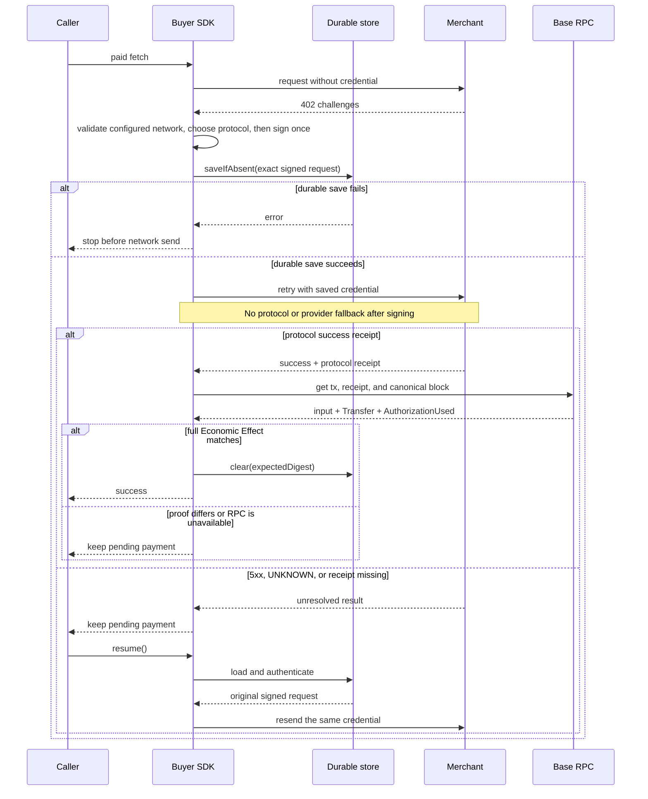

# Protocol selection and payment recovery

Owner: Pay SDK maintainers

Status: RC contract

Evidence state: Implemented without end-to-end evidence; local gates pass

Last verified: 2026-08-19

This is the implementation contract for `@0xkey-io/pay/client` and
`@0xkey-io/pay/server`. The package README is the public quickstart. Generated
versions and support facts are in [`generated-support.md`](./generated-support.md).

## Scope

Pay v1 supports two wire protocols over one EVM charge:

- x402 v2 `exact`;
- Machine Payments Protocol (MPP) `evm/charge`.

Both settle canonical USDC on Base. The caller must choose Base mainnet
(`eip155:8453`) or Base Sepolia (`eip155:84532`) explicitly. The same product
account can use both; there is no separate Sandbox workspace. MPP session and
all other rails are outside v1.

`mppx` owns MPP challenge, credential, receipt, and retry encoding. Official
`@x402/*` packages own ordinary x402 client encoding. 0xkey does not copy those
wire types or codecs.

## Seller flow

1. The framework adapter maps the request to one configured route.
2. `mppx/server` creates the enabled x402 and MPP challenges.
3. The buyer retries with exactly one payment credential.
4. `mppx` verifies the credential and calls the 0xkey facilitator adapter.
5. The adapter calls `/verify`, then `/settle`, with X-Stamp V2.
6. The facilitator waits until the Base transfer is `CONFIRMED`.
7. The SDK returns `paymentId` and then calls the merchant handler.
8. The protocol receipt is attached to the merchant response.

`CONFIRMED` is the v1 delivery bar. `FINALIZED` is observed later. A protocol
receipt proves that the protocol payment reached its success bar. It does not
prove that the merchant fulfilled the request.

If both `PAYMENT-SIGNATURE` and `Authorization: Payment` are present, the SDK
returns `400 AMBIGUOUS_PAYMENT_CREDENTIAL`. It does not settle either one.

If the merchant handler fails after payment, the response keeps the receipt.
The SDK calls `onFulfillmentFailed` or writes a small error log. Pay v1 does not
refund automatically. A handler with side effects must use `paymentId` as its
idempotency key.

## Buyer choice

The default order is x402, then MPP. `protocolPreference` may change that order.
The buyer accepts only enabled hosts, Base, canonical USDC, and an amount at or
below `maxAmount`.

`network` is required and cannot be inferred. Base mainnet requires an explicit
RPC in `rpcUrls["eip155:8453"]`, or an audited `receiptVerifier`, when the buyer
is created. The rate-limited Base mainnet public RPC is rejected. Base Sepolia
may use the public Sepolia endpoint.

Server and Admin instances route through the corresponding
`/base-mainnet` or `/base-sepolia` Pay channel. On `https://api-pay.0xkey.io`, the
SDK accepts only the selected canonical channel and rejects every other path.
`pay.0xkey.io` serves the product website and is never a facilitator base URL.
Custom local URLs remain available for tests, but they still represent exactly
the configured network.

`mppx 0.8.17` needs its route-binding extension when it signs ordinary x402.
Many normal x402 sellers do not send that extension. If this exact error occurs
before any credential is signed, the SDK may give the original request to the
pinned official x402 client.

After any credential is signed, fallback is forbidden. The SDK must not:

- switch x402 to MPP or MPP to x402;
- switch provider;
- create another signature because a response was lost.

The SDK does not patch global `fetch`. Redirects with payment state are denied.
HTTPS is required, except explicit loopback HTTP for local work.

## Signed-payment recovery sequence



The success branch requires both the standard protocol receipt and Base proof.
No 0xkey receipt extension is required, so the buyer stays compatible with an
ordinary official x402 seller.

## Save before send

A signed EIP-3009 credential can move money. It must be saved before the first
network send.

Production therefore requires one `PendingPaymentStore`. The store must:

- encrypt and authenticate the whole record;
- keep its key outside the record;
- implement atomic `saveIfAbsent`;
- implement atomic compare-and-delete `clear`;
- reject changed or unreadable data.

`saveIfAbsent` failure stops the send. One SDK instance also allows only one
payment call at a time. More than one process may resend the same saved
credential, but facilitator Economic Effect idempotency prevents a second
broadcast.

The in-memory store is for tests and local work only. A process crash can lose
it.

## Unknown result and resume

Any 5xx after a credential is signed means the payment may have reached the
provider or chain. It does not mean “not paid”. The normal unknown response is
`503 PAYMENT_STATUS_UNKNOWN`, with stable `paymentId` and `Retry-After: 2`.
The buyer treats any unexpected signed-request 5xx the same way.

The buyer keeps the saved request and may call `payFetch.resume()` to resend the
same credential. A merchant or server operator with the organization API key
may query payment status through `@0xkey-io/pay/admin`; an ordinary buyer cannot.

It must not make a new signature. A normal `payFetch(...)` call is blocked while
a saved payment exists.

On restart, `resume()` checks the saved payer, protocol, Base network, canonical
USDC, amount, recipient, host, URL, method, headers, and body before sending.
A v3 pending snapshot stores the selected network inside its authenticated
record; opening it under the other network is rejected before sending.
A plain 2xx, 4xx, or 5xx without a protocol success receipt does not clear it.

A success receipt also does not clear it by itself. The buyer reads the named
Base transaction and requires all of these facts to match the saved credential:

- expected Base chain and canonical USDC contract;
- successful receipt in the currently canonical block;
- direct USDC `transferWithAuthorization` call with the exact payer, recipient,
  amount, validity window, and nonce;
- matching USDC `Transfer` and `AuthorizationUsed` events.

A mismatch returns `PAYMENT_RECEIPT_MISMATCH`. An unavailable RPC returns
`PAYMENT_RECEIPT_UNVERIFIED`. Both leave the durable slot in place and block a
new signature. `resume()` reuses the same credential.

## Receipt names

MPP `Payment-Receipt` and x402 `PAYMENT-RESPONSE` are protocol receipts. They are
not the Commerce `Settlement Receipt` defined by 0xkey's Commerce domain. Pay v1
does not claim Mandate or budget assurance.

## RC release checks

The public boundary tests cover full receipt-to-effect proof, RPC failure,
ordinary official x402 receipts, and same-credential recovery for every 5xx.
The interoperability smoke runs all four x402/MPP × Base mainnet/Sepolia pairs
and asserts challenge, credential snapshot, facilitator channel, canonical
asset, settlement response, and receipt evidence never cross networks.

## Change rules

Update this file in the same pull request when any of these change:

- protocol selection or fallback;
- payment credential storage or resume;
- success receipt or fulfillment behavior;
- supported network, asset, intent, or scheme;
- public SDK option or entry point.
- the save-before-send, fallback, receipt, or resume sequence shown above.

Run:

```bash
pnpm --filter @0xkey-io/pay docs:check
```
