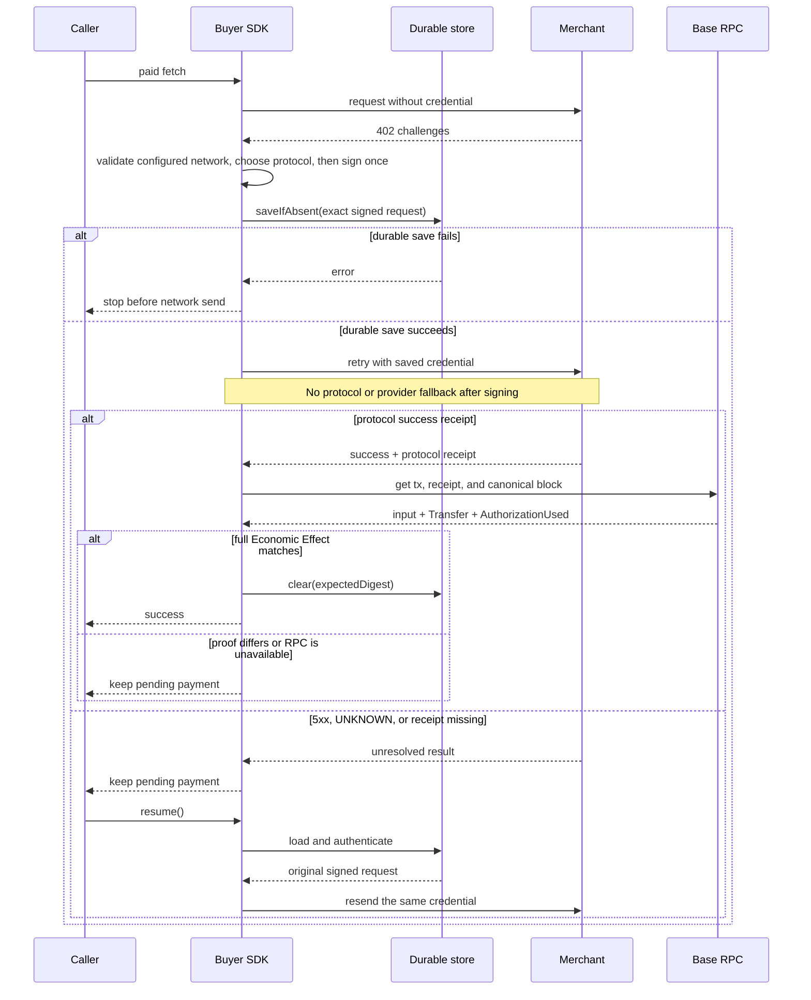

# Protocol selection and payment recovery

Owner: Pay SDK maintainers

Status: RC contract

Evidence state: Implemented without end-to-end evidence; local gates pass

Last verified: 2026-08-27

This is the implementation contract for `@0xkey-io/pay/client` and
`@0xkey-io/pay/server`. The package README is the public quickstart. Generated
versions and support facts are in [`generated-support.md`](./generated-support.md).

## Scope

Pay v1 supports two wire protocols over one EVM charge:

- x402 v2 `exact`;
- Machine Payments Protocol (MPP) `evm/charge`.

Both settle canonical USDC on Base. The caller must choose Base mainnet
(`eip155:8453`) or Base Sepolia (`eip155:84532`) explicitly. The same product
account can use both; there is no separate Sandbox workspace. MPP session and
all other rails are outside v1.

`mppx` owns MPP challenge, credential, receipt, and retry encoding. Official
`@x402/*` packages own ordinary x402 client encoding. 0xkey does not copy those
wire types or codecs.

The package peer contract keeps one `@x402/core@2.23.0` and `mppx@0.8.19`
class owner and retains the public `viem>=2.54.0 <3` runtime dependency.

The direct MPP entry has an exact `mppx@0.8.19` peer so its typed settlement
boundary error and the consumer's `Mppx.create()` share one class identity.
For an indeterminate command result, the mppx internal route union still says
402, but the contained HTTP Response is 503, carries `Retry-After: 2`, and has
no retry challenge or receipt. Official framework adapters return that Response
without calling the paid handler. Raw mppx clients do not durably replay a 503;
the caller must persist and resend the same Authorization credential or use the
0xkey buyer recovery facade.

## Seller flow

Before this flow, key-backed construction validates complete compressed P-256
hex encoding, private scalar range, and public/private pairing locally through
the shared X-Stamp factory. Invalid material fails synchronously with redacted
`PAY_PROFILE_INVALID` (`configuration`, not retryable, no `paymentId` or crypto
cause), including MPP-only offers. Custom adapter stampers remain an explicit
injection contract; their remote credentials are not locally validated.

1. The framework adapter maps the request to one configured route.
2. The official x402 resource server and native mppx method independently
   create the enabled challenges; the facade merges only standard headers.
3. The buyer retries with exactly one payment credential.
4. The credential header freezes the protocol. The official x402 server or
   native mppx method validates only its own wire, then maps it through its own
   0xkey-owned command adapter.
5. x402 calls `/verify` with the official private facilitator envelope, then
   the 0xkey seller converts the verified effect and calls
   `/v1/settlements/charge` with
   `{ organizationId, command }`; MPP calls the same command settlement
   endpoint. Every private call uses X-Stamp V2 and an explicit wire protocol.
6. The facilitator waits until the Base transfer is `CONFIRMED`.
   Both private settle paths accept only the exact nested envelope, configured
   network, verified payer, non-zero success transaction, and correctly typed
   optional fields.
7. The SDK returns `paymentId` and then calls the merchant handler.
8. The protocol receipt is attached to the merchant response.

`CONFIRMED` is the v1 delivery bar. `FINALIZED` is observed later. A protocol
receipt proves that the protocol payment reached its success bar. It does not
prove that the merchant fulfilled the request.

If both `PAYMENT-SIGNATURE` and `Authorization: Payment` are present, the SDK
returns `400 AMBIGUOUS_PAYMENT_CREDENTIAL`. It does not settle either one.

If the merchant handler succeeds, the SDK synchronously persists `FULFILLED`
before returning the protocol receipt. A throw or 5xx synchronously persists
`FAILED` without exception text, credentials, bodies, or receipts. MPP never
attaches a receipt to a failed handler; x402 uses its official upfront
failure-path receipt. Only fulfillment HTTP 200 is committed. A timeout or
non-200 is retryable `PAYMENT_STATUS_UNKNOWN`; recovery resends the same
credential after a process restart. A handler with side effects must use its
private `paymentId` context as the idempotency key.

## Buyer choice

The default order is x402, then MPP. `policy.preference` may change that order.
The buyer accepts only enabled hosts, Base, canonical USDC, and an amount at or
below `maxAmount`.

`network` is required and cannot be inferred. `policy` explicitly binds the
host allowlist, amount ceiling, and optional preference. `recovery` is always a
durable authenticated store. `verification` contains either one explicit RPC
URL or one audited verifier. The rate-limited Base mainnet public RPC is
rejected; Base Sepolia may use its public endpoint.

Server and Admin instances route through the corresponding
`/base-mainnet` or `/base-sepolia` Pay channel. On the Production
`https://api-pay.0xkey.io` and staging
`https://api-pay.staging.0xkey.io` origins, the SDK accepts only the root or the
selected canonical channel as an exact raw string and rejects every other URL
shape before normalization. `pay.0xkey.io` and `pay.staging.0xkey.io` serve the
product websites and are never facilitator base URLs. Custom local and
third-party URLs remain available, but they still represent exactly the
configured network.

Protocol choice is made only from the independently validated challenges and
configured preference. The seller dispatches only from `PAYMENT-SIGNATURE` or
the RFC-compatible, case-insensitive `Payment` authorization scheme, including
comma-separated Authorization fields. It never uses nonce shape, provider
identity, or dependency error text as a protocol signal.

After any credential is signed, fallback is forbidden. The SDK must not:

- switch x402 to MPP or MPP to x402;
- switch provider;
- create another signature because a response was lost.

The SDK does not patch global `fetch`. Redirects with payment state are denied.
HTTPS is required, except explicit loopback HTTP for local work.

## Signed-payment recovery sequence



The success branch requires both the standard protocol receipt and Base proof.
No 0xkey receipt extension is required, so the buyer stays compatible with an
ordinary official x402 seller.

## Save before send

A signed EIP-3009 credential can move money. It must be saved before the first
network send.

Production therefore requires one `PendingPaymentStore`. The store must:

- encrypt and authenticate the whole record;
- keep its key outside the record;
- implement atomic `saveIfAbsent`;
- implement atomic compare-and-delete `clear`;
- reject changed or unreadable data.

`saveIfAbsent` failure stops the send. One SDK instance also allows only one
payment call at a time. More than one process may resend the same saved
credential, but facilitator Economic Effect idempotency prevents a second
broadcast.

There is no client option that disables recovery or silently selects an
in-memory store. Tests can inject a test implementation of the same store
contract.

## Unknown result and resume

Any 5xx after a credential is signed means the payment may have reached the
provider or chain. It does not mean “not paid”. The normal unknown response is
`503 PAYMENT_STATUS_UNKNOWN` with `Retry-After: 2`. The private `paymentId`
never appears in a standard response object, receipt, or header.
The buyer treats any unexpected signed-request 5xx the same way.

The buyer keeps the saved request and may call `client.resume()` to resend the
same credential. A merchant or server operator with the organization API key
may query payment status through `@0xkey-io/pay/admin`; an ordinary buyer cannot.

It must not make a new signature. A normal `client.fetch(...)` call is blocked
while a saved payment exists.

On restart, `resume()` checks the saved payer, protocol, Base network, canonical
USDC, amount, recipient, host, URL, method, headers, and body before sending.
A v3 pending snapshot stores the selected network inside its authenticated
record. It also stores the stable protocol id, literal adapter revision
`pay-client-v1`, and a digest of the normalized EIP-3009 Economic Effect. The
request digest binds those fields together with URL, method, headers, and body.
Opening it under the other network is rejected before sending. An rc.6-shaped
version-3 record missing any new binding fails with
`PENDING_PAYMENT_VERSION_UNSUPPORTED` and is never upgraded or re-signed.
A plain 2xx, 4xx, or 5xx without a protocol success receipt does not clear it.

A success receipt also does not clear it by itself. The buyer reads the named
Base transaction and requires all of these facts to match the saved credential:

- expected Base chain and canonical USDC contract;
- successful receipt in the currently canonical block;
- direct USDC `transferWithAuthorization` call with the exact payer, recipient,
  amount, validity window, and nonce;
- matching USDC `Transfer` and `AuthorizationUsed` events.

A mismatch returns `PAYMENT_RECEIPT_MISMATCH`. An unavailable RPC returns
`PAYMENT_RECEIPT_UNVERIFIED`. Both leave the durable slot in place and block a
new signature. `resume()` reuses the same credential.

`pending()` exposes only request digest, protocol alias/id, network, URL, and
method. Credential-bearing headers, body, receipts, and the complete Economic
Effect remain confined to the protected store.

## Receipt names

MPP `Payment-Receipt` and x402 `PAYMENT-RESPONSE` are protocol receipts. They are
not the Commerce `Settlement Receipt` defined by 0xkey's Commerce domain. Pay v1
does not claim Mandate or budget assurance.

## RC release checks

The public boundary tests cover full receipt-to-effect proof, RPC failure,
ordinary official x402 receipts, and same-credential recovery for every 5xx.
The interoperability smoke runs all four x402/MPP × Base mainnet/Sepolia pairs
and asserts challenge, credential snapshot, facilitator channel, canonical
asset, settlement response, and receipt evidence never cross networks.

## Change rules

Update this file in the same pull request when any of these change:

- protocol selection or fallback;
- payment credential storage or resume;
- success receipt or fulfillment behavior;
- supported network, asset, intent, or scheme;
- public SDK option or entry point.
- the save-before-send, fallback, receipt, or resume sequence shown above.

Run:

```bash
pnpm --filter @0xkey-io/pay docs:check
```
