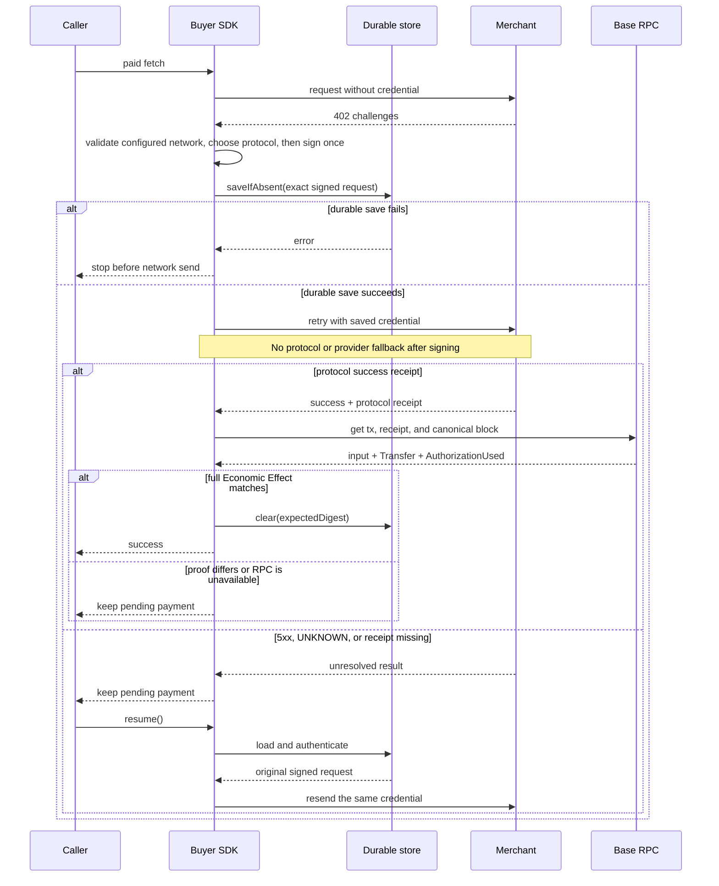

# Protocol selection and payment recovery

Owner: Pay SDK maintainers

Status: RC contract

Evidence state: Implemented without end-to-end evidence; local gates pass

Last verified: 2026-08-28

This is the implementation contract for `@0xkey-io/pay/client` and
`@0xkey-io/pay/server`. The package README is the public quickstart. Generated
versions and support facts are in [`generated-support.md`](./generated-support.md).

## Scope

Pay v1 supports two wire protocols over one EVM charge:

- x402 v2 `exact`;
- Machine Payments Protocol (MPP) `evm/charge`.

Both settle canonical USDC on Base. The caller must choose Base mainnet
(`eip155:8453`) or Base Sepolia (`eip155:84532`) explicitly. The same product
account can use both; there is no separate Sandbox workspace. MPP session and
all other rails are outside v1.

`mppx` owns MPP challenge, credential, receipt, and retry encoding. Official
`@x402/*` packages own ordinary x402 client encoding. 0xkey does not copy those
wire types or codecs.

The package peer contract requires `@x402/core@2.23.0` and `mppx@0.8.19`
and retains the public `viem>=2.54.0 <3` runtime dependency. Exact version
agreement alone cannot enforce JavaScript class ownership across physical
copies, subpaths, or CJS/ESM conditions.

For the dedicated direct x402 entry, configure `facilitatorResponseError` with
the official constructor from the consumer's actual `@x402/core/server` owner.
The resource, HTTP server, and framework must share that owner. Omission keeps
Pay's imported 2.23 constructor; unconfigured 2.22 or mixed-owner error paths
can incorrectly become 402. Structural constructor validation cannot detect
a valid but wrong owner. The [direct integration contract](./direct-x402.md)
and strict public examples define the tested 2.22/2.23 natural upfront path.
This direct path settles before the handler and echoes its settlement once;
the following seller flow describes the separate 0xkey-owned facade.

The direct MPP entry keeps its exact `mppx@0.8.19` peer. Its optional
`paymentError` takes native `Errors.PaymentError` from the same physical public
`mppx` module as the consumer's `Mppx.create()`. Omission keeps the SDK-resolved
owner; exact version agreement is not proof of identity. The typed
[public recipe](./examples/mpp-upfront.ts) supports pinned native 0.8.19 and
0.8.17 constructor composition, not arbitrary constructors or cross-realm
plugins. A separate 0.8.17 owner is not a peer-clean downgrade claim.

The factory captures this dependency and creates its settlement-error subclass
and transport recognition per factory. It synchronously validates the safe
Problem Details shape using only synthetic public probe values, before payment
I/O. Invalid configuration fails redacted with `PAY_PROFILE_INVALID`, phase
`configuration`, not retryable, no `paymentId` or retained constructor cause;
there is no fallback. Shape validation cannot attest the owner of a separately
created Mppx: a valid wrong physical constructor is an integration-profile
failure, not promised early rejection. Public settlement Problem Details only
include `errorCode` and `retryable` under `details`; private payment identity,
original causes, credentials, stamps and provider data are never forwarded.
For an indeterminate command result, the mppx internal route union still says
402, but the contained HTTP Response is 503, carries `Retry-After: 2`, and has
no retry challenge or receipt. Official framework adapters return that Response
without calling the paid handler. Raw mppx clients do not durably replay a 503;
the caller must persist and resend the same Authorization credential or use the
0xkey buyer recovery facade.

## Seller flow

Before this flow, key-backed construction validates complete compressed P-256
hex encoding, private scalar range, and public/private pairing locally through
the shared X-Stamp factory. Invalid material fails synchronously with redacted
`PAY_PROFILE_INVALID` (`configuration`, not retryable, no `paymentId` or crypto
cause), including MPP-only offers. Custom adapter stampers remain an explicit
injection contract; their remote credentials are not locally validated.

1. The framework adapter maps the request to one configured route.
2. The official x402 resource server and native mppx method independently
   create the enabled challenges; the facade merges only standard headers.
3. The buyer retries with exactly one payment credential.
4. The credential header freezes the protocol. The official x402 server or
   native mppx method validates only its own wire, then maps it through its own
   0xkey-owned command adapter.
5. x402 calls `/verify` with the official private facilitator envelope, then
   the 0xkey seller converts the verified effect and calls
   `/v1/settlements/charge` with
   `{ organizationId, command }`; MPP calls the same command settlement
   endpoint. Every private call uses X-Stamp V2 and an explicit wire protocol.
6. The facilitator waits until the Base transfer is `CONFIRMED`.
   Both private settle paths accept only the exact nested envelope, configured
   network, verified payer, non-zero success transaction, and correctly typed
   optional fields.
7. The SDK returns `paymentId` and then calls the merchant handler.
8. The MPP receipt is attached only to a 2xx merchant response; x402 retains
   its official upfront receipt behavior.

`CONFIRMED` is the v1 delivery bar. `FINALIZED` is observed later. A protocol
receipt proves that the protocol payment reached its success bar. It does not
prove that the merchant fulfilled the request.

If both `PAYMENT-SIGNATURE` and `Authorization: Payment` are present, the SDK
returns `400 AMBIGUOUS_PAYMENT_CREDENTIAL`. It does not settle either one.

A credential for a disabled protocol returns `400 PAYMENT_PROTOCOL_NOT_ALLOWED`.
For exactly one selected MPP credential, the method checks raw outer, challenge,
payload, serialized-request, and method-details fields before native lossy
parsing. Invalid encoding/JSON, nonobject shapes, and unknown fields are
rejected with native mppx `402`, a fresh `WWW-Authenticate: Payment` challenge,
and `https://paymentauth.org/problems/malformed-credential` Problem Details.
No signing, private settlement, handler, fulfillment, or receipt follows that
rejection. An allowed raw payload missing typed fields retains native
`invalid-payload` 402; altering an otherwise allowed echoed challenge can fail
native HMAC provenance validation with `invalid-challenge` 402. The raw guard
does not duplicate native method schemas or challenge verification.
Headers without an extractable Payment credential remain outside
this selected-MPP category. x402 malformed-wire policy is unchanged.

This does not reclassify settlement dependency failures or `UNKNOWN`: those
remain non-402 without a fresh challenge or receipt. A signed buyer receiving
even a malformed-credential 402 keeps its pending record and must not sign
again, switch protocol/provider, or clear pending on the fresh challenge.

For any MPP handler response below 500, the SDK synchronously requests
`FULFILLED`. A throw or 5xx synchronously requests
`FAILED` without exception text, credentials, bodies, or receipts. MPP never
attaches a receipt to any non-2xx response, and removes a handler-supplied
`Payment-Receipt` even on the 5xx early-return path. This is independent of
fulfillment classification: 3xx/4xx remain `FULFILLED` but have no receipt and
cannot clear buyer pending. `FULFILLED` does not prove an application side
effect. Direct method receipt wrapping follows the same 2xx-only rule and
stays synchronous. All paths preserve status/status text/body stream/Location
and unrelated headers. Receipt wrapping retains native private-cache treatment;
the facade's 5xx early return retains its existing cache policy. x402 uses its
unchanged official upfront failure-path receipt. Only fulfillment HTTP 200 is
accepted as persistence acknowledgment. A timeout or
non-200 is retryable `PAYMENT_STATUS_UNKNOWN`; recovery resends the same
credential after a process restart. A handler with side effects must use its
private `paymentId` context as the idempotency key.

## Buyer choice

The default order is x402, then MPP. `policy.preference` may change that order.
The buyer accepts only enabled hosts, Base, canonical USDC, and an amount at or
below `maxAmount`.

`network` is required and cannot be inferred. `policy` explicitly binds the
host allowlist, amount ceiling, and optional preference. `recovery` is always a
durable authenticated store. `verification` contains either one explicit RPC
URL or one audited verifier. The rate-limited Base mainnet public RPC is
rejected; Base Sepolia may use its public endpoint.

Server and Admin instances route through the corresponding
`/base-mainnet` or `/base-sepolia` Pay channel. On the Production
`https://api-pay.0xkey.io` and staging
`https://api-pay.staging.0xkey.io` origins, the SDK accepts only the root or the
selected canonical channel as an exact raw string and rejects every other URL
shape before normalization. `pay.0xkey.io` and `pay.staging.0xkey.io` serve the
product websites and are never facilitator base URLs. Custom local and
third-party URLs remain available, but they still represent exactly the
configured network.

Protocol choice is made only from the independently validated challenges and
configured preference. Native Payment challenges are decoded independently of
x402's `PAYMENT-REQUIRED` offer. Neither realm nor challenge-id spelling is a
protocol discriminator. The MPP executor uses one private native-only HTTP
transport and retains mppx parsing, signing, encoding and its single payment
retry; it never collects the default mixed x402/MCP bridge. Credential attachment
preserves request parameters, body, signal and unrelated headers, replacing
Authorization and the three x402 payment headers with the native credential.

An MPP realm is an opaque protection-space label, not an origin or hostname.
Valid labels such as `x402` and `billing` are echoed unchanged and remain bound
by the native challenge nonce and server HMAC. Actual HTTPS/host policy and
redirect refusal are separate checks. The buyer cannot verify the server's
secret HMAC, and that HMAC does not establish arbitrary HTTP URL binding.
The durable store's AEAD/MAC authenticates the exact saved URL, method, headers
and body; the request digest alone is only a checksum. All existing v3
protocol/network/adapter/economic bindings remain mandatory, with no format
migration or re-signing.

The seller dispatches only from `PAYMENT-SIGNATURE` or
the RFC-compatible, case-insensitive `Payment` authorization scheme, including
comma-separated Authorization fields. It never uses nonce shape, provider
identity, or dependency error text as a protocol signal.

After any credential is signed, fallback is forbidden. The SDK must not:

- switch x402 to MPP or MPP to x402;
- switch provider;
- create another signature because a response was lost.

The SDK does not patch global `fetch`. Redirects with payment state are denied.
HTTPS is required, except explicit loopback HTTP for local work.

## Signed-payment recovery sequence



The success branch requires both the standard protocol receipt and Base proof.
No 0xkey receipt extension is required, so the buyer stays compatible with an
ordinary official x402 seller.

## Save before send

A signed EIP-3009 credential can move money. It must be saved before the first
network send.

Production therefore requires one `PendingPaymentStore`. The store must:

- encrypt and authenticate the whole record;
- keep its key outside the record;
- implement atomic `saveIfAbsent`;
- implement atomic compare-and-delete `clear`;
- reject changed or unreadable data.

`saveIfAbsent` failure stops the send. One SDK instance also allows only one
payment call at a time. More than one process may resend the same saved
credential, but facilitator Economic Effect idempotency prevents a second
broadcast.

There is no client option that disables recovery or silently selects an
in-memory store. Tests can inject a test implementation of the same store
contract.

## Unknown result and resume

Buyer error classification follows typed provenance, not error text. Only a
local `PayError` preserves its supplied classification and identity. Unknown
errors, non-Error thrown values and foreign/lookalike errors use the explicit
operation fallback with safe fixed text and the original value as `cause`:
`PAYMENT_SERVICE_UNAVAILABLE`, retryable, in `request` for `fetch` or `recovery`
for `resume`/`pending`; caught construction failures use `PAY_PROFILE_INVALID`,
`configuration`, not retryable. Owned policy, storage-state and receipt checks
produce typed errors at their source. Signer and receipt-verifier exceptions
are explicitly wrapped even if they are already typed; verifier exceptions are
the direct `cause` of `PAYMENT_RECEIPT_UNVERIFIED`.

Native x402 replaces signing exceptions with ordinary errors. The buyer keeps
its own signer failure only for that in-flight native operation, restores the
exact owned wrapper on rejection, and discards the provenance on every exit.
This gives `PAYMENT_SIGNING_FAILED`, phase `signing`, not retryable, fixed safe
text, no `paymentId`, and the original signer-thrown value directly as `cause`.
Caller `PayError`s are still wrapped, not accepted as signer policy verdicts.
No message or lookalike fields establish provenance. Later operations and
concurrent single-flight rejections remain independent; MPP behavior and the
unknown non-signer contextual fallback are unchanged. A throwing signer has
not produced a credential to save or send, and this adds no automatic retry.

Classification does not change recovery state. A failed `saveIfAbsent` stops
before send and keeps the in-process pending request. A thrown or false `clear`
does not clear pending. After a verified receipt and successful clear, pending
is cleared before synchronous `onReceipt`; a callback exception still propagates
and does not restore the cleared payment. Callback failures are not swallowed.

Any 5xx after a credential is signed means the payment may have reached the
provider or chain. It does not mean “not paid”. The normal unknown response is
`503 PAYMENT_STATUS_UNKNOWN` with `Retry-After: 2`. The private `paymentId`
never appears in a standard response object, receipt, or header.
The buyer treats any unexpected signed-request 5xx the same way.

The buyer keeps the saved request and may call `client.resume()` to resend the
same credential. A merchant or server operator with the organization API key
may query payment status through `@0xkey-io/pay/admin`; an ordinary buyer cannot.

It must not make a new signature. A normal `client.fetch(...)` call is blocked
while a saved payment exists.

On restart, `resume()` checks the saved payer, protocol, Base network, canonical
USDC, amount, recipient, host, URL, method, headers, and body before sending.
A v3 pending snapshot stores the selected network inside its authenticated
record. It also stores the stable protocol id, literal adapter revision
`pay-client-v1`, and a digest of the normalized EIP-3009 Economic Effect. The
request digest binds those fields together with URL, method, headers, and body.
Opening it under the other network is rejected before sending. An rc.6-shaped
version-3 record missing any new binding fails with
`PENDING_PAYMENT_VERSION_UNSUPPORTED` and is never upgraded or re-signed.
A plain 2xx, 4xx, or 5xx without a protocol success receipt does not clear it.

A success receipt also does not clear it by itself. The buyer reads the named
Base transaction and requires all of these facts to match the saved credential:

- expected Base chain and canonical USDC contract;
- successful receipt in the currently canonical block;
- direct USDC `transferWithAuthorization` call with the exact payer, recipient,
  amount, validity window, and nonce;
- matching USDC `Transfer` and `AuthorizationUsed` events.

A mismatch returns `PAYMENT_RECEIPT_MISMATCH`. An unavailable RPC returns
`PAYMENT_RECEIPT_UNVERIFIED`. Both leave the durable slot in place and block a
new signature. `resume()` reuses the same credential.

`pending()` exposes only request digest, protocol alias/id, network, URL, and
method. Credential-bearing headers, body, receipts, and the complete Economic
Effect remain confined to the protected store.

## Receipt names

MPP `Payment-Receipt` and x402 `PAYMENT-RESPONSE` are protocol receipts. They are
not the Commerce `Settlement Receipt` defined by 0xkey's Commerce domain. Pay v1
does not claim Mandate or budget assurance.

## RC release checks

The public boundary tests cover full receipt-to-effect proof, RPC failure,
ordinary official x402 receipts, and same-credential recovery for every 5xx.
The interoperability smoke runs all four x402/MPP × Base mainnet/Sepolia pairs
and asserts challenge, credential snapshot, facilitator channel, canonical
asset, settlement response, and receipt evidence never cross networks.

## Change rules

Update this file in the same pull request when any of these change:

- protocol selection or fallback;
- payment credential storage or resume;
- success receipt or fulfillment behavior;
- supported network, asset, intent, or scheme;
- public SDK option or entry point.
- the save-before-send, fallback, receipt, or resume sequence shown above.

Run:

```bash
pnpm --filter @0xkey-io/pay docs:check
```
